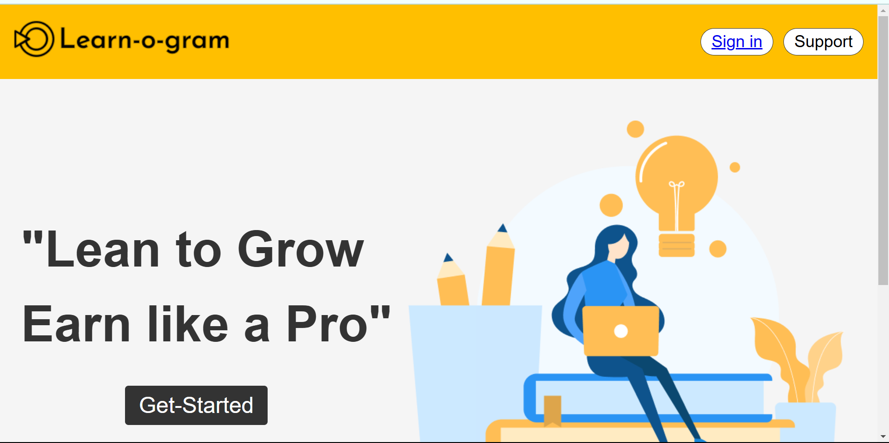

#📚 EdTech Course Video Platform

    A modern, easy-to-use web platform for online education and video-based learning. This project allows students to explore courses, watch educational videos, and track their progress.

🚀 Features

    📹 Course Videos: Watch high-quality educational content.
    📚 Course Management: Browse and enroll in multiple courses.
    🔒 User Authentication: Secure login, registration, and profile management.
    📝 Progress Tracking: Track course completion and progress.
    🌐 Responsive Design: Accessible on desktop, tablet, and mobile devices.

